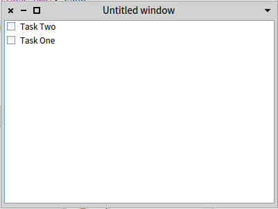
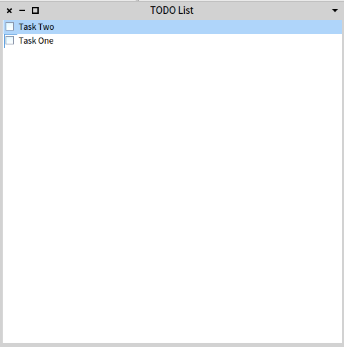
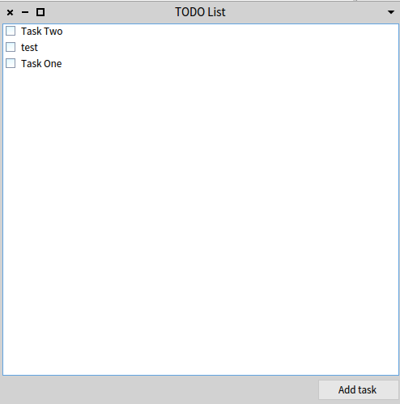
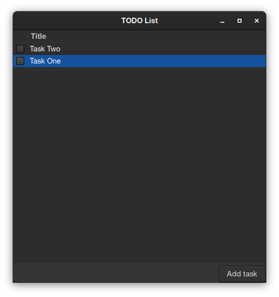

# TODO Application: a 15min tutorial

## Introduction
This is a small tutorial to give a first look at the world of Spec2 and developing application with it.  
It should not be taken as a comprehensive guide since a lot of details and featurs are left out explicitly to avoid difficult issues. 
  
We will build a small TODO application that will connect a couple of components and it will show some interesting characteristics.
It will look like Figure *@taskManager@*.


## Requirements

We will use Voyage to keep our small database, but since this will not be very big and we want to keep things simple, we will use an "in-memory" version of it. You can install it in your image executing:
```Smalltalk
Metacello new 
	repository: 'github://pharo-nosql/voyage';
	baseline: 'Voyage';
	load: 'memory tests'.
```

Then you can create the in-memory repository we are going to use during this tutorial.
```Smalltalk
VOMemoryRepository new enableSingleton.
```

### A TODOTask class
Since this application will show and support the edition of a simple TODO list, we need to create a class that models the task. We are going to have the simplest approach possible for this example, but is clear it can be a lot more complex.

```Smalltalk
Object subclass: #TODOTask
	slots: { #done. #title }
	classVariables: {  }
	package: 'TODO'
	
TODOTask >> title
	^ title
	
TODOTask >> title: aString
	title := aString
	
TODOTask >> done: aBoolean
	done := aBoolean
	
TODOTask >> initialize

	super initialize.
	self done: false
```

And let's create a couple of testing tasks: 

```Smalltalk
TODOTask new title: 'Task One'; save.
TODOTask new title: 'Task Two'; save.
```

## Creating your application

Every application needs an entry point, a place where to configure the basics and start the GUI. Compiled programs have like C have `main()`, Cocoa have the class `NSApplication` and you add a *delegate* to add your configuration and Gtk3 has `GtkApplication`.  
Pharo is a living environment where many things can be executed at same time, and because of that Spec2 also needs its own entry point: Your application needs to be independent of the rest of system! To do that, Spec2 needs you to extend the class `SpApplication`.  

```Smalltalk
SpApplication subclass: #TODOApplication
	slots: {  }
	classVariables: {  }
	package: 'TODO'
```

Note that an application is not a visual element, it manages the application and information that may be displayed visually such as icons.

You will also need your main window, a TODO list.  
In Spec2, all components that you create inherit (directly or indirectly) from a single root base class: `SpPresenter`. A _presenter_ is how you expose (present) your data to the user.  


We create a presenter, named `TODOListPresenter` to hold a list of todo items. 

```Pharo
SpPresenter subclass: #TODOListPresenter
	slots: {  }
	classVariables: {  }
	package: 'TODO'
```

This component will contain a list of your todo tasks. Let's define your first presenter contents.   

## Showing tasks

A presenter needs to define a _layout_ (how the component and its subcomponents will be displayed) and which _widgets_ it will show.  
While this is not the best way to organise your presenter, for simplicity we will add all needed behavior in just a single method that you need to implement: `initializePresenters`.

```Smalltalk
TODOListPresenter >> initializePresenters

	todoListPresenter := self newTable
		addColumn: ((SpCheckBoxTableColumn evaluated: [:aTask | aTask isDone]) width: 20);
		addColumn: (SpStringTableColumn title: 'Title' evaluated: [:aTask | aTask title]);
		yourself.

	self layout: (SpBoxLayout newVertical 
		add: todoListPresenter;
		yourself) 
```


Even if we want to manage a list, we use a table because we want to display multiple information side by side.
In this case, you are adding to your presenter a table widget, which is a very complex component by itself. Let us explain what each part of it means: 

- `newTable` is the factory method that will create the table component you are going to use to display your TODO list.
- `addColumn:` is the way you add different table columns (you can have several, if we wanted to have just a single string we would have use a list).
- `SpCheckBoxTableColumn evaluated: [:aTask | aTask isDone]` will create a table column that will display the status of your TODO task (done or not done).
- `width: 20` This is to avoid the column to take all available space (otherwise, the table component will distribute the available space proportionally by column).
- `SpStringTableColumn title: 'Title' evaluated: [:aTask | aTask title])` Same as `SpCheckBoxTableColumn` but it will create a column that has a title and it will to show a string.  

And about the layout definition: 

- `SpBoxLayout newVertical` will create a box layout that will distribute elements in vertical arrangement.
- `add: todoListPresnter` you can add components like this. Note that by default, the box layout will distribute all elements in proportional way (since this is the only element for the moment, it will take 100% of the avalaible space.  

And now, we need to give our TODO list the tasks to display:

```Smalltalk
TODOListPresenter >> updatePresenter

	todoListPresenter items: TODOTask selectAll asOrderedCollection
```

Note we send `asOrderedCollection` message to the list of tasks. This is because a table presenter receives an `OrderedCollection` as items, so we make sure we have the list as the presenter wants.  

How does this look? 
```Smalltalk
TODOApplication new run.
```


Not bad as a start, isn't?  
But you will see the window has "Untitled window" as title, and maybe its size is not right.  
To fix this we will need to implement another method `initializeWindow:`, which will let us set the values we want.  
You may ask *why this is done like that and not directly modifying the presenter?* And the answer is quite simple: Presenters are designed to be reusable. This means that a presenter can be used as a window in some cases (as ours), but it can be used as a part of another presenter in other. Then we need to split its functionality between *presenter* and *presenter window*.

```Smalltalk
initializeWindow: aWindowPresenter

	aWindowPresenter 
		title: 'TODO List';
		initialExtent: 500@500
```

Here we took `aWindowPresenter` (the presenter that contains definition of a window), and we add: 

- `title:` which is self explanatory, it will set the title of the window
- `initialExtent:` it will declare the initial size of the window.

How it will look now?



## Making checkbox columns actionable

If you play a little bit with your newly created presenter, you will notice that if you enable the task checkbox and you re-execute the application (reopen the window), nothing changes in the task, it is still marked as not done. This is because no action is yet associated to the checkbox column!  
To fix this, let's modify `initializePresenters`
```Smalltalk
TODOListPresenter >> initializePresenters

	todoListPresenter := self newTable
		addColumn: ((SpCheckBoxTableColumn evaluated: #isDone) 
			width: 20;
			onActivation: [ :task | task done: true ];
			onDeactivation: [ :task | task done: false ];
			yourself);
		addColumn: (SpStringTableColumn title: 'Title' evaluated: #title);
		yourself.

	self layout: (SpBoxLayout newVertical 
		add: todoListPresenter;
		yourself)
```
We added

- `onActivation:`/`onDeactivation:` messages who add behavior to make sure our task gets updated.  

Now you will see everything changes as expected.

## Adding new tasks to your list

Now, how do we add new elements? We will need different things: 

1. Modify your presenter to add a button to allow you the creation of tasks. 
2. A dialog to ask for your new task.  

Let's create that dialog first.

```Smalltalk
SpPresenter subclass: #TODOTaskPresenter
	slots: { #task. #titlePresenter }
	classVariables: {  }
	package: 'TODO'
	
TODOTaskPresenter >> task
	^ task
	
TODOTaskPresenter >> task: aTask
	task := aTask.
	self updatePresenter
```

This is very simple, the only thing that is different is that setting a task will update the presenter (because it needs to show the contents of the title). And now we define initialization and update of our presenter. SD: I do not get it since the two methods have the same name. 

```Smalltalk	
TODOTaskPresenter >> initializePresenters

	titlePresenter := self newTextInput.

	self layout: (SpBoxLayout newVertical 
		add: titlePresenter expand: false;
		yourself).
		
TODOTaskPresenter >> updatePresenter
	titlePresenter text: (aTask title ifNil: [ '' ])

```

This is almost equal to our list presenter, but there are a couple of new elements.

- `newTextInput`, it will create a text input presenter to add to our layout.
- `add: titlePresenter expand: false` Along with the addition of the presenter, we also tell the layout that it should not expand the text input. The `expand` property indicates the layout will not resize the presenter to take the whole available space.
- `titlePresenter text: (aTask title ifNil: [ '' ])` this changes the contents of out text input presenter.

Now, we need to define this presenter to act as a dialog.  
And we do it in the same way (almost) we defined `TODOListPresenter` as window. But to define a *dialog presenter* we need to define the method `initializeDialogWindow:`.
```Smalltalk
TODOTaskPresenter >> initializeDialogWindow: aDialogWindowPresenter

	aDialogWindowPresenter 
		title: 'New task';
		initialExtent: 350@120;
		addButton: 'Accept' do: [ :dialog |
			self accept.
			dialog close ];
		addButton: 'Cancel' do: [ :dialog |
			dialog close ]
```

Here, along with the already known `title:` and `initialExtent:` we added 

- `addButton: 'Save' do: [ ... ]`. This will add buttons to our dialog window. And you need to define its behavior (the `accept` method).
- `addButton: 'Cancel' do: [ ... ]`. This is the same as the positive action, but here we do not want to do anything, that's why we just send `dialog close`.

And how it would be the `accept` method? Thanks to voyage, very simple.
```Smalltalk
TODOTaskPresenter >> accept

	self task 
		title: titlePresenter text;
		save.
```

**Tip:** You can test your dialog even if not yet integrated to your application by executing 

```Smalltalk
TODOTaskPresenter new 
	task: TODOTask new;
	openModalWithSpec.
```

So, now we can use it. And to use it we need to define how we want to present that "add task" option. It can be a toolbar, an actionbar or a simple button. To remain simple and expand a little what we already know about layouts, we will use a simple button and for that, we go back again to `TODOListPresenter >> initializePresenters`

```Smalltalk
TODOListPresenter >> initializePresenters
	| addButton |

	todoListPresenter := self newTable
		addColumn: ((SpCheckBoxTableColumn evaluated: #isDone) 
			width: 20;
			onActivation: [ :task | task done: true ];
			onDeactivation: [ :task | task done: false ];
			yourself);
		addColumn: (SpStringTableColumn title: 'Title' evaluated: #title);
		yourself.

	addButton := self newButton 
		label: 'Add task';
		action: [ self addTask ];
		yourself.

	self layout: (SpBoxLayout newVertical 
		add: todoListPresenter;
		add: (SpBoxLayout newHorizontal
				addLast: addButton expand: false;
				yourself) 
			expand: false;
		yourself)
```

What we added here?  
First, we added a button.

- `newButton` creates a button presenter. 
- `label:` sets the label of the button.
- `action:` sets the action block to execute when we press the button.

Second, we modify our layout by adding a new layout! *Yes, layouts can be composed!*.  

- `spacing: 5` is used to set the space between presenters, otherwise they will apprear stick together and this is not visually good. 
- `SpBoxLayout newHorizontal` will create a box layout that will be arranged horizontally.
- `addLast: addButton expand: false` will add the button at the end (sorting it effectively at the end, as if it would be a dialog). The `expand` property indicates the layout will not resize the button to take the whole available space.
- finally, the layout itself was added with `expand` set to `false` to prevent the button to take half the size vertically. 

**NOTE:** The expand property is important to place your elements correctly, but it does not do magic: when this property is set the layout will take the default size of the presenter added to determine its place. But it may happen that the defaults are not good and there are different things you can do (like define your own style), but this will not covered in this tutorial (we will work on that later).  

Finally we create the method `addTask`.
```Smalltalk
TODOListPresenter >> addTask

	(TODOTaskPresenter newApplication: self application) 
		task: TODOTask new;
		openModalWithSpec.
	self updatePresenter
```

What we did here?

- `TODOTaskPresenter newApplication: self application` we create the dialog presenter but not by calling `new` as usual but `newApplication:` and passing the application of current presenter. This is **fundamentally important** to keep your dialogs chained as part of your application. If you skipt this, what will happen is that the presenter will be created in the *default application* of Pharo, which is called `NullApplication`. You do not want that. 
- `task:` set a new task
- `openModalWithSpec` it will open the dialog in modal way. It means the execution of your program will be stop until you accept or cancel your dialog.
- `updatePresenter` will call the method we defined, to update your list.

How it looks now?



## Add edit and remove

But a task list is not just adding tasks. Sometimes we want to edit a tast or even remove it.  
Let's add a context menu to table for this, and for it we will always need to modify `initializePresenters`. 

```Smalltalk
TODOListPresenter >> initializePresenters
	| addButton |

	todoListPresenter := self newTable
		addColumn: ((SpCheckBoxTableColumn evaluated: #isDone) 
			width: 20;
			onActivation: [ :task | task done: true ];
			onDeactivation: [ :task | task done: false ];
			yourself);
		addColumn: (SpStringTableColumn title: 'Title' evaluated: #title);
		contextMenu: self todoListContextMenu;
		yourself.

	addButton := self newButton 
		label: 'Add task';
		action: [ self addTask ];
		yourself.

	self layout: (SpBoxLayout newVertical 
		spacing: 5;
		add: todoListPresenter;
		add: (SpBoxLayout newHorizontal
				addLast: addButton expand: false;
				yourself) 
			expand: false;
		yourself)
```

What is added now? 
 
- `contextMenu: self todoListContextMenu` this sets the context menu to what is defined in the method `todoListContextMenu`.


```Smalltalk
TODOListPresenter >> todoListContextMenu

	^ self newMenu 
		addItem: [ :item | item name: 'Edit...'; action: [ self editSelectedTask ] ];
		addItem: [ :item | item name: 'Remove'; action: [ self removeSelectedTask ] ]
```

This method will create a menu to be displayed when pressing right-click on the table. Let's see what it contains: 

- `self newMenu` as all other *factory methods*, this will create a menu presenter to be attached to another presenter.
- `addItem: [ :item | ... ]` add an item, with a `name:` and an associated `action:`

And now let's define the actions

```Smalltalk
TODOListPresenter >> editSelectedTask

	(TODOTaskPresenter newApplication: self application) 
		task: todoListPresenter selection selectedItem;
		openModalWithSpec.
	self updatePresenter
```

```Smalltalk	
TODOListPresenter >> removeSelectedTask

	todoListPresenter selection selectedItem remove.
	self updatePresenter
```

As you see, `editSelectedTask` is almost equal to `addTask` but instead adding a new task, it takes the selected task in our table by sending `todoListPresenter selection selectedItem`.  
Remove simply takes the selected item and send the `remove` message.


## Switching the backend to Gtk

Since I am doing a Spec2 application, I can decide to use Gtk as a backend instead of Morphic. How to do this?

You need to load the Gtk backend.

```Smalltalk
Metacello new 
	repository: 'github://pharo-spec/mars-gtk';
	baseline: 'Mars';
	load.
```

(Do not worry if you have a couple of messages asking to "load" or "merge" a Spec2 package, this is because the baseline has Spec2 in its dependencies and it will "touch" the packages while loading the Gtk backend).

Now, you can execute

```Smalltalk
TODOApplication new 
	useBackend: #Gtk;
	run.
```

And that's all, you have your todo application runing. 



